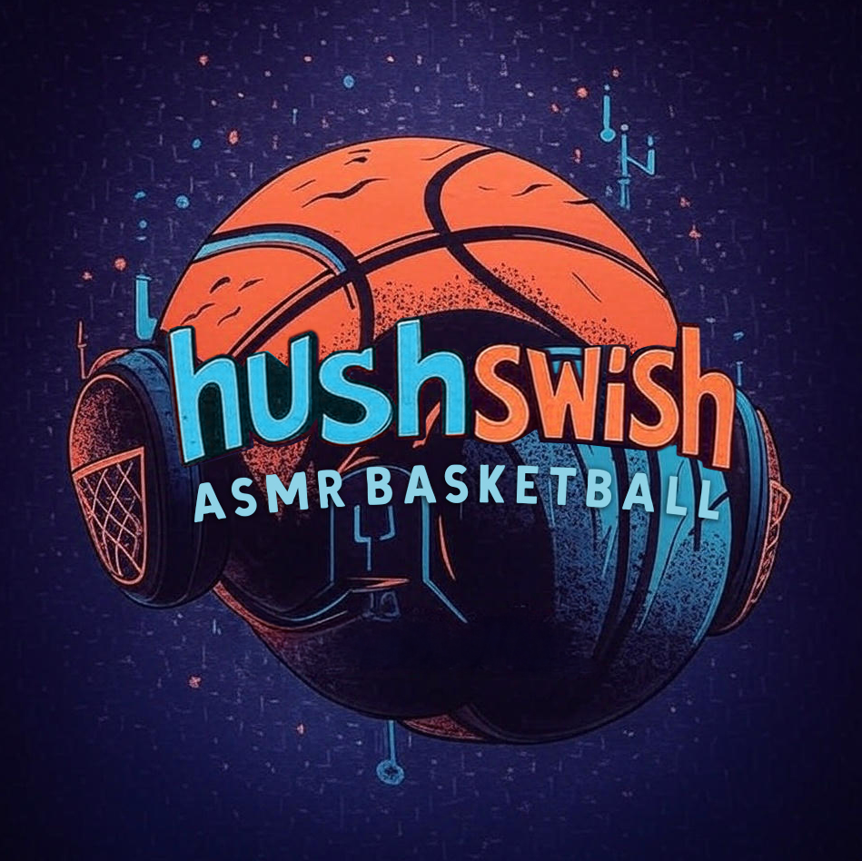

# Stream Design Gallery - Project Documentation

## 📋 Project Overview

Created **20 unique stream overlay design mockups** for "Silent Basketball" - an ASMR NBA 2K streaming channel. Each design showcases different visual styles, layouts, and widget combinations to help choose the final stream aesthetic.

**Project Location:** `overlay/stream-designs/`

**Status:** ✅ Complete - 20 designs ready for selection and implementation

---

## 🎯 Project Goals

1. **Visual variety** - 20 completely different design styles
2. **Mature aesthetic** - Sophisticated, calming ASMR vibe (NOT hyper-gaming)
3. **Minimal gameplay coverage** - Overlays stay in corners/edges, CENTER MUST BE CLEAR
4. **Unique & memorable** - Stand out from typical NBA 2K streams
5. **Real preview** - Uses actual gameplay video as background
6. **Data visualization** - Heatmaps, infographics, charts, sound waves, beat visualizers
7. **Terminator-style HUD** - Cool diagrams and analysis overlays

---

## 📁 File Structure

```
overlay/stream-designs/
├── index.html                  # Navigation gallery (START HERE)
├── logo.png                    # User's logo (used in all designs)
├── design-01.html              # Soundwave Minimalist
├── design-02.html              # Neon Futuristic
├── design-03.html              # Framed Elegance
├── design-04.html              # Floating Bubbles
├── design-05.html              # Gradient Flow
├── design-06.html              # Geometric Modern
├── design-07.html              # Ambient Glow
├── design-08.html              # Corner Clusters
├── design-09.html              # Zen Minimal
├── design-10.html              # Dynamic Asymmetric
├── design-11.html              # Terminator HUD ⭐ NEW
├── design-12.html              # Circular Data Streams ⭐ NEW
├── design-13.html              # Court Heat Vision ⭐ NEW
├── design-14.html              # Radar Analytics ⭐ NEW
├── design-15.html              # Matrix Data Stream ⭐ NEW
├── design-16.html              # Neon Dashboard ⭐ NEW
├── design-17.html              # Split Screen Analytics ⭐ NEW
├── design-18.html              # Holographic Overlay ⭐ NEW
├── design-19.html              # Minimalist Tech ⭐ NEW
├── design-20.html              # Data Storm ⭐ NEW
└── styles/
    └── common.css              # Shared base styles
```

**Background Assets:**
- `game.mp4` - 1 minute gameplay video (project root)
- `logo.png` - User's logo (in stream-designs folder)

---

## 🎨 All 20 Design Concepts

### Design 1: Soundwave Minimalist
- **Signature Element:** Audio-reactive waveform across top
- **Color Palette:** Teal/white on dark
- **Vibe:** Clean, modern, instantly recognizable
- **Widgets:** Soundwave, branding, score, social, momentum (5)

### Design 2: Neon Futuristic
- **Signature Element:** Glowing neon accents
- **Color Palette:** Cyan/purple/pink neon
- **Vibe:** Cyberpunk meets ASMR
- **Widgets:** Player bubble, score, neon title, ASMR badge, stats bar (5)

### Design 3: Framed Elegance
- **Signature Element:** Gold decorative frame around entire screen
- **Color Palette:** Gold/white borders
- **Vibe:** Premium, sophisticated
- **Widgets:** Full frame, branding, score, NBA tracker, corner decorations (5)

### Design 4: Floating Bubbles
- **Signature Element:** Circular bubbles that float
- **Color Palette:** Soft pastels with transparency
- **Vibe:** Playful yet sophisticated
- **Widgets:** 2 player bubbles, score bubble, branding, ASMR, momentum (6)

### Design 5: Gradient Flow
- **Signature Element:** Smooth flowing color gradients
- **Color Palette:** Purple→blue→green transitions
- **Vibe:** Calming, colorful, flowing
- **Widgets:** Gradient banner, sidebar stats, bottom panel, player card, ASMR (5)

### Design 6: Geometric Modern
- **Signature Element:** Sharp angular shapes (hexagons, triangles)
- **Color Palette:** Monochrome + orange accent
- **Vibe:** Bold, architectural, modern
- **Widgets:** Angular cluster, hexagon player, triangle momentum, bottom bar, ASMR (5)

### Design 7: Ambient Glow
- **Signature Element:** Soft glowing pulsing lights
- **Color Palette:** Warm orange/peach glows
- **Vibe:** Cozy, warm, inviting ASMR
- **Widgets:** Glow banner, corner widgets, score, player spotlight, ASMR pulse, ticker (6)

### Design 8: Corner Clusters
- **Signature Element:** Organized grouping in corners
- **Color Palette:** Multiple accent colors (teal, orange, purple)
- **Vibe:** Organized chaos, strategic placement
- **Widgets:** Top-left cluster (branding+NBA), bottom-right cluster (score+stats), ASMR badge, floating player, momentum bar (6)

### Design 9: Zen Minimal
- **Signature Element:** Ultimate minimalism
- **Color Palette:** White/cream on subtle dark
- **Vibe:** Let gameplay breathe, pure simplicity
- **Widgets:** Tiny branding, single bottom line, ASMR text, occasional player card, breathing dot (5)

### Design 10: Dynamic Asymmetric
- **Signature Element:** Intentional artistic chaos
- **Color Palette:** Bold vibrant asymmetric layout
- **Vibe:** Artistic composition, unexpected placements
- **Widgets:** Diagonal banner, offset score, 2 rotated player cards, off-center ASMR, dynamic stats, floating accent (6)

### Design 11: Terminator HUD ⭐ NEW
- **Signature Element:** Sci-fi tactical HUD with grid overlay and scanning effects
- **Color Palette:** Green (#00ff88) on black - classic HUD aesthetic
- **Vibe:** Terminator/tactical analysis, data-focused
- **Special Features:**
  - Full-screen HUD grid overlay (50px squares)
  - Corner brackets (borders only)
  - Animated scanning line that moves top to bottom
  - Live stats panel with 6 data rows
  - Court heatmap with hot/warm/cool zones (shot chart visualization)
  - 8-bar audio visualizer at bottom
  - Glitch animation effect
  - Score display with terminal-style fonts
- **Widgets:** HUD grid, corner brackets, data panel, score, heat map, audio viz (6)

### Design 12: Circular Data Streams ⭐ NEW
- **Signature Element:** Rotating orbital rings around central logo hub
- **Color Palette:** Orange (#FF6B35) and cyan (#00B0FF)
- **Vibe:** Sci-fi orbits, planetary data system
- **Special Features:**
  - Central logo hub in top-left (moved from center for gameplay visibility)
  - 3 animated orbit rings rotating at different speeds
  - 4 circular data nodes showing PTS, REB, AST, BLK
  - Top waveform container with 10 animated wave lines
  - Data stream lines flowing across screen
  - Bottom score stream panel
- **Widgets:** Central hub, orbit rings, data nodes, waveform, score stream, ASMR badge (6)

### Design 13: Court Heat Vision ⭐ NEW
- **Signature Element:** Large translucent heat map overlay on the court
- **Color Palette:** Red/pink (#FF0064) heat zones
- **Vibe:** Thermal vision, hot spot analysis
- **Special Features:**
  - Large court heatmap overlay with pulsing hot spots
  - Live shot chart panel showing made/missed shots as circles (green=made, red=missed)
  - Shot percentages: FG%, 3PT%, FT%
  - 7-circle beat visualizer with pulsing animation
  - Real-time stats ticker scrolling at bottom (infinite loop)
  - Ticker shows Q3, Lead, Fast Break, Dunks
- **Widgets:** Court heatmap, shot chart, score, beat viz, stats ticker (5)

### Design 14: Radar Analytics ⭐ NEW
- **Signature Element:** Pentagon radar chart for team performance analysis
- **Color Palette:** Cyan (#00D9D6) on dark blue
- **Vibe:** Analytics dashboard, radar scanning
- **Special Features:**
  - Large circular radar chart with 5-point analysis (Offense, Defense, Rebounds, Assists, Blocks)
  - 4 performance bars with gradient fills showing percentages
  - 12-bar frequency analyzer at bottom
  - Pulsing radar data overlay
  - All stats with animated bar fills
- **Widgets:** Performance panel, radar chart, score, frequency analyzer, ASMR indicator (5)

### Design 15: Matrix Data Stream ⭐ NEW
- **Signature Element:** Falling Matrix-style code columns
- **Color Palette:** Green monochrome (#0F0) - classic Matrix
- **Vibe:** Hacker terminal, digital rain
- **Special Features:**
  - 6 columns of falling data/binary code
  - Terminal-style scoreboard with command line interface
  - Blinking cursor animation
  - Terminal prompt lines showing game status, broadcast mode, lead, momentum
  - Infographic panel with 5 stats + animated progress bars
  - 10-bar sound wave at bottom
- **Widgets:** Falling data streams, terminal, infographics panel, sound wave, ASMR label (5)
- **Position Fix:** Terminal moved to top-right to keep center clear

### Design 16: Neon Dashboard ⭐ NEW
- **Signature Element:** Circular progress indicators (donuts) with neon glow
- **Color Palette:** Pink (#ff006e), cyan (#00f5ff), purple (#8338ec)
- **Vibe:** Vibrant neon dashboard, retro-futuristic
- **Special Features:**
  - 3 animated circular progress charts (SVG) for FG%, 3PT%, FT%
  - Floating particle effects (4 particles)
  - 10-bar beat visualizer with gradient colors
  - Stats grid with 6 rows
  - Glowing neon text effects throughout
- **Widgets:** Progress circles, main scoreboard, stats grid, beat visualizer, particles (5)
- **Position Fix:** Scoreboard moved to top to keep center clear

### Design 17: Split Screen Analytics ⭐ NEW
- **Signature Element:** Side-by-side team comparison panels
- **Color Palette:** Red (#FF4757) vs Blue (#3742FA) with gold accent (#FFA502)
- **Vibe:** Head-to-head comparison, versus mode
- **Special Features:**
  - Split screen gradient overlays (left and right 50% darkening)
  - Two full team stat panels showing 7 stats each
  - Color-coded stats (red for left team, blue for right)
  - Comparison bar at top showing lead visually
  - 10-bar dual-color waveform (alternating red/blue bars)
  - Central branding with gold accents
- **Widgets:** Left panel, right panel, center brand, comparison bar, wave comparison (5)
- **Position Fix:** Comparison bar moved to top edge

### Design 18: Holographic Overlay ⭐ NEW
- **Signature Element:** Hologram effect with floating hexagons and shimmer
- **Color Palette:** Cyan (#00FFF0) and purple (#7B61FF) gradient
- **Vibe:** Futuristic hologram projection, sci-fi interface
- **Special Features:**
  - 4 floating hexagons with rotation animation
  - Shimmer/hologram animation on all borders
  - Gradient borders using border-image
  - Scan lines overlay (subtle repeating lines)
  - Rotating logo with 3D effect
  - Backdrop blur filters for depth
  - 12-bar spectrum analyzer
  - Separate offense/defense data panels
- **Widgets:** Data panels (left/right), main scoreboard, spectrum, hexagons, scan lines (6)
- **Position Fix:** Main scoreboard moved higher to reduce center obstruction

### Design 19: Minimalist Tech ⭐ NEW
- **Signature Element:** Clean tech lines with gold accents and minimal elements
- **Color Palette:** Gold (#FFD700) on pure black
- **Vibe:** Ultra-minimal, luxury tech, Apple-esque
- **Special Features:**
  - Horizontal and vertical tech lines creating frame structure
  - 4 glowing decorative dots at line intersections
  - Pulsing logo animation
  - 8 circle wave visualizer (outlined circles, no bars)
  - Corner data boxes with minimal stats
  - Large centered score display (moved to top)
  - Very clean, breathable layout
- **Widgets:** Tech lines, corner data boxes (2), score display, circle wave, decorative dots (6)
- **Position Fix:** Score widget moved to top to keep center clear

### Design 20: Data Storm ⭐ NEW
- **Signature Element:** Particle storm with angled clip-path panels
- **Color Palette:** Pink (#FF2E63) and cyan (#08D9D6)
- **Vibe:** Chaotic energy, data overload, cyberpunk max
- **Special Features:**
  - 6 animated particles flying across screen with trails
  - 4 corner indicators with pulsing animation (L-shaped brackets)
  - All panels use clip-path polygons (angled cuts)
  - Central data hub with rotating logo
  - 8-cell data grid showing all stats
  - 14-bar mega wave visualizer (largest audio viz)
  - Particle storm animation throughout
- **Widgets:** Particle storm, corner indicators, data hub, data grid, mega wave (5)

---

## 🎮 How to Use

### Viewing the Designs

1. **Open the navigation page:**
   ```
   overlay/stream-designs/index.html
   ```

2. **Click any design card** to view full-screen mockup (1920x1080)

3. **Each design shows:**
   - Live gameplay video background (loops continuously)
   - All overlay widgets positioned and styled
   - User's actual logo (logo.png)
   - Realistic placeholder data (e.g., PHI 87 vs MIL 92, Q3 6:42)

### Design Selection Process

1. View all 20 designs with actual gameplay running
2. Note which styles feel right for the ASMR aesthetic
3. Consider readability over moving gameplay
4. **Check that center is clear** - make sure you can see the game action
5. Pick 1-3 favorites to develop further

---

## 🔑 Key Design Decisions

### CENTER SCREEN MUST BE CLEAR (CRITICAL!)

**Problem Identified:** Designs 12, 15, 16, 17, 18, 19 initially had large boxes in the center blocking gameplay

**Solution Implemented:**
- **Design 12:** Moved central orbit hub to top-left corner
- **Design 15:** Moved terminal to top-right 
- **Design 16:** Moved neon scoreboard to top (still centered horizontally)
- **Design 17:** Moved comparison bar to top edge
- **Design 18:** Moved holographic scoreboard higher up
- **Design 19:** Moved minimal score widget to top

**Rule for Next Agent:** Center 50% of screen horizontally and 40% vertically should be kept as clear as possible. Overlays go in corners, edges, and periphery only.

### Player Highlights (IMPORTANT!)

**Problem Identified:** Standalone player bubbles looked random - "Best player of what?"

**Solution Implemented:**
- Player highlights are now **tied to the current game**
- Include team labels: "MIL Leader", "Game Leader", "Hot Hand"
- Marked as **dynamic/occasional** elements
  
**Behavior:** Player highlights should appear/disappear dynamically during:
- Scoring runs (6-0 run, etc.)
- Big plays (dunks, blocks)
- Hot shooting streaks
- Quarter/half summaries
- Only show after 2nd quarter starts

**Implementation Note:** When making these functional, player cards should fade in/out smoothly without affecting other widget positions. Use the Glow Pulse animation from memory.

### Branding Requirements

Every design includes:
- ✅ User's actual logo (`logo.png`)
- ✅ "SILENT BASKETBALL" text
- ✅ "ASMR" indicator/badge
- ✅ Both are clearly visible and on-brand

### Design Philosophy

- **Gameplay first** - No overlays block center court action
- **Mature aesthetic** - Avoid hyper-gamer vibes
- **Unique signature** - Each has a memorable element
- **ASMR appropriate** - Calming colors, smooth animations, peaceful compositions
- **Data visualization** - Show stats in interesting ways (charts, graphs, heatmaps)

---

## 🛠 Technical Details

### Technologies Used
- **HTML5/CSS3** - Pure vanilla, no frameworks
- **CSS Animations** - @keyframes for all movement/pulses
- **SVG** - Used in Design 16 for circular progress charts
- **Video Background** - HTML5 video element (autoplay, loop, muted)
- **Resolution** - 1920x1080 (standard stream size)

### Common Styles (`styles/common.css`)
- Base resets and typography
- Video background container
- Animation utilities (pulse, glow, fadeIn)
- Player highlight animations (fade in/out, slide)
- Shared widget styles

### Design-Specific Styles
- Each `design-XX.html` has inline `<style>` tag
- All positioning, colors, and animations are self-contained
- Easy to copy/modify individual designs

### Logo Implementation
User provided `logo.png` in the stream-designs folder. Used consistently across all 20 designs:
```html

```

### Video Background
```html
<div class="game-background">
  <video autoplay loop muted playsinline>
    <source src="../../game.mp4" type="video/mp4">
  </video>
</div>
```
- Loops continuously
- Muted (ASMR stream will use game audio separately)
- `playsinline` for mobile compatibility
- Centered and scaled to cover entire viewport

---

## 📊 New Data Visualization Features

### Designs 11-20 Added These Elements:

#### Audio/Sound Visualizers
- **Beat visualizers** - Animated bars reacting to "music"
  - Design 11: 8 bars (green)
  - Design 13: 7 circles (pink pulse)
  - Design 14: 12 bars (cyan)
  - Design 15: 10 bars (green Matrix)
  - Design 16: 10 bars (neon gradient)
  - Design 17: 10 bars (dual-color red/blue)
  - Design 18: 12 bars (holographic gradient)
  - Design 19: 8 circles (gold outlines)
  - Design 20: 14 bars (mega visualizer)

- **Waveforms** - Flowing wave patterns
  - Design 12: 10 wave lines

#### Charts & Analytics
- **Heatmaps** - Show hot zones
  - Design 11: Court heatmap grid (hot/warm/cool cells)
  - Design 13: Large court overlay with pulsing hot spots

- **Shot Charts** - Make/miss visualization
  - Design 13: Grid of circles (green=made, red=missed)

- **Radar Charts** - Pentagon performance analysis
  - Design 14: 5-point radar (offense, defense, rebounds, assists, blocks)

- **Progress Circles** - Circular percentage indicators
  - Design 16: 3 SVG donut charts with animated fills

- **Data Grids** - Organized stat displays
  - Design 20: 8-cell grid with all stats

#### Infographics
- **Progress Bars** - Horizontal bar fills
  - Design 14: 4 performance bars
  - Design 15: 5 stat bars with fills

- **Real-time Stats Ticker** - Scrolling text
  - Design 13: Infinite scroll ticker with game stats

- **Data Panels** - Organized stat displays
  - Design 11: Live stats panel (6 rows)
  - Design 15: Infographics panel (5 stats + bars)
  - Design 18: Offense/Defense split panels

#### Special Effects
- **HUD Elements** - Terminator-style
  - Design 11: Grid overlay, corner brackets, scanning line, glitch effect

- **Matrix Code** - Falling data streams
  - Design 15: 6 columns of falling binary/text

- **Particles** - Floating elements
  - Design 16: 4 glowing particles
  - Design 18: 4 floating hexagons
  - Design 20: 6 particle storm elements

- **Tech Lines** - Minimal structural elements
  - Design 19: Horizontal and vertical gold lines with glowing dots

- **Holographic Effects** - Sci-fi styling
  - Design 18: Shimmer animation, scan lines, gradient borders

---

## 📝 Code Patterns

### Adding a New Widget
```css
.new-widget {
  position: absolute;
  top: 50px;
  right: 50px;
  background: rgba(0, 0, 0, 0.8);
  backdrop-filter: blur(15px);
  padding: 20px;
  border-radius: 12px;
  border: 2px solid #yourcolor;
}
```

### Creating Beat Visualizer Bars
```css
.beat-bar {
  flex: 1;
  background: linear-gradient(to top, #color1, #color2);
  animation: beat-pulse 0.8s ease-in-out infinite;
}

@keyframes beat-pulse {
  0%, 100% { height: 20%; opacity: 0.5; }
  50% { height: var(--peak-height); opacity: 1; }
}

.beat-bar:nth-child(1) { --peak-height: 60%; animation-delay: 0s; }
.beat-bar:nth-child(2) { --peak-height: 80%; animation-delay: 0.1s; }
/* etc */
```

### Logo Implementation
```html

```

### Video Background Pattern
```html
<div class="game-background">
  <video autoplay loop muted playsinline>
    <source src="../../game.mp4" type="video/mp4">
  </video>
</div>
```

### Avoiding Center Obstruction
```css
/* DON'T DO THIS - blocks center */
.bad-widget {
  position: absolute;
  top: 50%;
  left: 50%;
  transform: translate(-50%, -50%);
}

/* DO THIS - stays at edge */
.good-widget {
  position: absolute;
  top: 50px;  /* or bottom: 50px */
  left: 50px; /* or right: 50px */
}
```

---

## 🎯 Success Criteria

The final implemented design should:
- ✅ Look unique and memorable
- ✅ Have minimal gameplay obstruction (CENTER CLEAR!)
- ✅ Be readable during fast gameplay
- ✅ Feel calming and ASMR-appropriate
- ✅ Include dynamic player highlights that make sense
- ✅ Show user's logo and "Silent Basketball" branding clearly
- ✅ Include interesting data visualizations (charts, heatmaps, etc.)
- ✅ Have audio/beat visualizations
- ✅ Work with existing NBA API infrastructure
- ✅ Be different from typical 2K streams

---

## 🔗 Related Files

### Existing Overlay System
- `overlay/game-stats/` - Current functional overlay
- `overlay/shared/nbaApi.js` - ESPN API integration
- `overlay/dashboard/` - Control panel for game selection
- `server.js` - Local server (port 3000)

### Documentation
- `docs/ARCHITECTURE.md` - System architecture
- `docs/API.md` - API reference
- `docs/FEATURES.md` - Feature list
- `docs/PROJECT_RULES.md` - Project rules and guidelines

### Design References
- `overlay/other streamers/` - 10 examples of what NOT to do
- `ideas/` - Initial design concept images

---

## 💡 Design Insights from User Feedback

### What User Likes ✅
- Unique elements that stand out (soundwaves, player bubbles, heatmaps, charts)
- Minimal gameplay coverage
- Clean, organized layouts
- User's actual logo integrated
- Real gameplay video preview
- Beat visualizers and sound waves
- Infographics and data visualization
- Terminator-style HUD and analysis elements

### What User Dislikes ❌
- **Big boxes in the center blocking gameplay** (CRITICAL - fixed in designs 12, 15, 16, 17, 18, 19)
- Big boxes covering gameplay on left/right sides
- Too many scattered random widgets (chaotic)
- Generic gaming aesthetics (sub counters, follower goals)
- Standalone player stats without game context
- Hyper/screaming color schemes

### User's Stream Concept
- **ASMR Basketball** - Pure game sounds, no commentary
- **Calming vibe** - Relaxing to watch, not hyper-energetic
- **Unique & different** - Stand out from typical 2K streams
- **Professional** - Mature, sophisticated aesthetic
- **Data-rich** - Show interesting stats, heatmaps, analysis

---

## 📞 Handoff Checklist

- ✅ 20 unique designs created (doubled from 10!)
- ✅ Navigation page functional and updated
- ✅ Gameplay video integrated
- ✅ User's logo added to all designs
- ✅ Dynamic player highlights contextualized
- ✅ All designs include branding
- ✅ Beat visualizers added (9 designs)
- ✅ Sound waves implemented (4 designs)
- ✅ Heatmaps created (2 designs)
- ✅ Infographics with progress bars (3 designs)
- ✅ Shot charts added (1 design)
- ✅ Radar charts implemented (1 design)
- ✅ Terminator HUD style created (1 design)
- ✅ Matrix data stream design (1 design)
- ✅ Center obstruction fixed in 6 designs
- ✅ File structure organized
- ✅ Documentation updated and comprehensive
- ⏳ Awaiting design selection
- ⏳ Awaiting functional implementation

---

## 💬 Questions for Next Session

1. **Which design(s) did you pick?** (or top 3-5 from all 20)
2. **Any color adjustments needed?**
3. **Which data visualization do you like most?** (heatmap, shot chart, beat viz, etc.)
4. **Ready to make it functional?** (connect to ESPN API)
5. **Should player highlights auto-detect or manual trigger?**
6. **Want to test in OBS first or develop more?**
7. **Should audio visualizers react to real game audio or just animate?**

---

## 🚀 Next Steps for Implementation

### Phase 1: Design Selection
1. Review all 20 designs with gameplay video
2. Select final design (or top 2-3 to refine)
3. Get feedback on readability and aesthetic
4. Confirm center visibility is good

### Phase 2: Refinement
1. Adjust colors if needed for specific game courts
2. Fine-tune widget positions based on actual gameplay
3. Test with different NBA 2K game modes (MyCareer, MyTeam, etc.)
4. Verify readability on different monitors/stream qualities
5. Adjust data visualization colors for better contrast

### Phase 3: Make It Functional
1. Connect to ESPN NBA API (existing `overlay/shared/nbaApi.js`)
2. Implement dynamic player highlights:
   - Track scoring runs
   - Detect momentum shifts
   - Show/hide player cards with Glow Pulse animation
   - Only show after 2nd quarter
3. Make beat visualizers react to game audio (Web Audio API)
4. Populate heatmaps with real shot data
5. Update shot charts with live game data
6. Fill progress bars and charts with real stats
7. Integrate with existing dashboard (`overlay/dashboard/`)
8. Set up style switcher to change designs on the fly

### Phase 4: OBS Integration
1. Add as OBS Browser Source
2. Test transparent backgrounds
3. Configure refresh intervals
4. Set up scene transitions
5. Test with actual streaming setup
6. Verify audio visualizer performance

---

**Created:** November 21, 2025  
**Updated:** November 21, 2025 (Added designs 11-20, fixed center obstruction)  
**Project:** Silent Basketball ASMR Stream Overlay  
**Status:** 20 design mockups complete, ready for selection and implementation  
**Logo:** User's logo.png integrated into all designs
